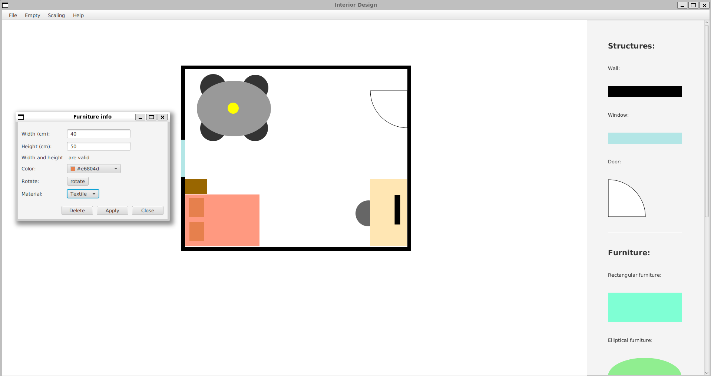

# Interior Design Tool

A 2D interior design application for arranging furniture in customizable room layouts from a top-down perspective.

## Features

- **2D Floorplan Editor**: Create floorplans and place furniture objects on them.
- **Object Manipulation**: Resize, rotate, recolor, and move furniture.
- **Collision Detection**: Prevents similar objects from overlapping.
- **Scaling Tool**: Adjust the scale of all objects via percentage input.
- **File Handling**: Load floorplan images and export the design as image files.
- **Interactive GUI**: Includes dialogs for object input, scaling, and help. Furniture can be modified via contextual menus.

<figure>
  
  <figcaption>A screenshot that shows the main functions</figcaption>
</figure>

More information about the process including a uml-class-diagram can be found in [Loppudokumentti](Loppudokumentti.pdf).